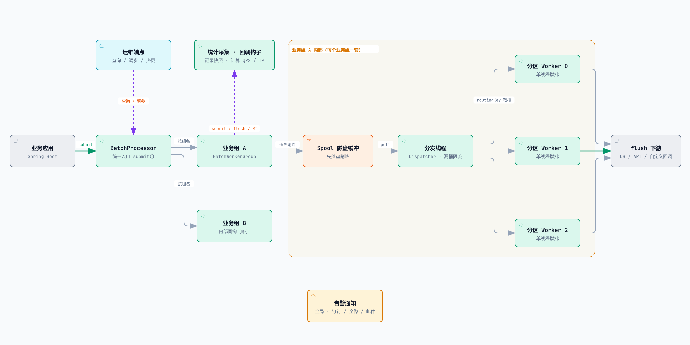

<div align="center">

# Dynamic Batch

**轻量级可监控动态批处理框架**

进程内攒批 · 基于 Chronicle Queue 的磁盘级缓冲 · 百万级 QPS · 微秒级延迟

[](LICENSE)


[](https://jitpack.io)

</div>

---

## 项目定位

Dynamic Batch 面向**单体应用（进程内）的高并发异步批处理**场景：业务侧逐条产生的写库、调用下游等动作，由框架收敛为**按批提交**，并在同一条链路上内建**削峰缓冲**、**分区有序**、**限流**、**参数热更**、**运行监控**与**失败告警**。

框架以库的形态嵌入业务进程，运行于单个 JVM 实例内部，不跨进程、不做网络分发，**不引入任何外部中间件**；对业务代码的侵入仅为一次组注册与一次 `submit` 调用。应用多实例部署时，各实例独立消化自身流量，可水平扩展。

数据主链路：`submit` → Spool 磁盘缓冲（Chronicle Queue）→ Dispatcher 分发（漏桶限流）→ 分区 Worker 攒批 → `flushCallback` 写下游，完整架构见[架构设计](#架构设计)一节。

工程实现与使用姿势参考了 [dromara/dynamic-tp](https://github.com/dromara/dynamic-tp)（动态可监控线程池框架）：依赖引入即自动装配、以「组」为管理单元、配置可运行时变更、能力通过 SPI 扩展、运维通过 Actuator 端点收口。

---

## 解决的问题

1. **下游写入被逐条打爆**：高频场景下每条数据一次 DB 交互，QPS 高、连接与事务开销大，批量接口能力被浪费。
2. **自建攒批难以治理**：队列、线程、攒批窗口、失败处理散落在业务代码中，缺少统一模型，重复建设且难以复用。
3. **有单体削峰解耦诉求，但不想为此引入 MQ**：场景只需要缓冲突发流量、隔离下游压力，不需要跨进程分发与消费组语义时，进程内磁盘缓冲即可满足，无需承担一套消息中间件的部署、高可用与运维成本。
4. **攒批链路是黑盒**：吞吐、延迟分位、队列水位、磁盘积压缺乏运行时数据，异常缺少主动通知，往往在业务受损后才被发现。

---

## 核心特性

- **零中间件依赖**：进程内接入，引入 Starter、注册业务组、提交数据即可使用，不额外部署任何服务端组件。

- **磁盘级削峰缓冲**：Spool 基于 [Chronicle Queue](https://github.com/OpenHFT/Chronicle-Queue) 实现，读位置持久化于磁盘，进程重启后自动续读；持久化由 OS 自动刷盘兜底，进程异常退出仅丢失内存中未处理的数据，断电与幂等边界详见[使用手册](docx/usage-guide.md#14-数据送达语义)。**单体项目无需引入 MQ 即可完成削峰填谷。**

- **百万级吞吐、微秒级延迟**：单分区 128B 消息实测 **1,689,049 条/秒**，ping-pong 模式 **tp50 17.2µs / tp99 66.8µs**（口径与复现见[性能基准](#性能基准)）。

- **同键严格有序**：分区内 FIFO + 单线程消费，天然保证业务键维度的顺序性；不同分区之间并行，互不阻塞。

- **参数热更新与组级限流**：`batchSize` / `maxWaitMs` / `rateLimitPerSecond` 运行时调整、下一批即生效；分区数支持在线变更。限流由分发线程在取数侧以漏桶算法实现，可保护下游写入能力。

- **运行可观测**：组级统计采集器周期差分产出快照（提交/回调计数、QPS、RT 分桶分布、tp 分位、队列水位、暂存积压、磁盘占用拆分），可通过 Actuator 端点实时查询，亦可经 `StatsListener` 钩子推送至自建监控体系。

- **告警直达办公平台**：内置钉钉、企业微信、邮件渠道，覆盖入队失败、批次执行失败、磁盘容量三类事件，支持静默期与阈值配置；飞书等其余渠道可由 `Notifier` SPI 扩展（仓库内提供完整示例）。

- **轻量且高可扩展**：核心链路代码收敛、无重框架依赖；序列化、通知渠道、告警文案、JSON 引擎、统计出口均开放 SPI，用户可在不修改框架源码的前提下自定义实现。

- **Spool 可独立复用**：磁盘缓冲能力封装为独立模块 `dynamic-batch-spool`，不依赖批处理核心，可单独引入作为高性能本地磁盘队列使用（用法见[独立使用 Spool](#独立使用-spool)）。

---

## 架构设计



| 层次 | 组件 | 职责 |
|------|------|------|
| 接入层 | `BatchProcessor` | 统一门面：组注册表、`submit` 入口、运维 API、生命周期收口 |
| 隔离层 | `BatchWorkerGroup` | 以业务组为单位隔离队列、线程与磁盘目录，组间互不影响 |
| 缓冲层 | `Spool` | 基于 Chronicle Queue 的磁盘级 FIFO 蓄水池，承接流量尖峰 |
| 调度层 | `Dispatcher` | 每组一条分发线程：取数、漏桶限速、按 `routingKey` 路由投递 |
| 执行层 | `BatchWorker` | 每分区一个队列 + 单线程消费者，攒满 `batchSize` 或超 `maxWaitMs` 触发 `flushCallback` |
| 旁路 | 统计采集 / 告警通知 / 运维端点 | 快照采集与钩子推送、全局告警、查询与热更，均不阻塞主链路 |

> **交互版架构图**：`docx/architecture/architecture.json`（数据源）与 `docx/architecture/architecture.html`（可交互视图，支持「主链路与路由」「运维与告警」双视图切换与元素聚焦）。GitHub 不渲染仓库内 HTML，克隆源码后以浏览器打开该文件即可。

---

## 性能基准

以**单分区、字节透传（无序列化开销）、空回调**口径压测，度量攒批链路的架构上限（不含业务序列化与下游处理耗时）。

| 消息大小 | 吞吐（条/秒） | 字节吞吐（MB/s） | tp50（µs） | tp99（µs） | tp99.9（µs） |
|---------:|-------------:|----------------:|-----------:|-----------:|-------------:|
| 128B | 1,689,049 | 206 | 17.2 | 66.8 | 210.5 |
| 256B | 1,155,420 | 282 | 17.1 | 69.2 | 205.1 |
| 4KB | 244,185 | 954 | 21.8 | 112.5 | 237.4 |
| 64KB | 17,906 | 1,119 | 71.0 | 250.0 | 459.1 |

- **测试环境**：Windows 10 amd64 / 20 核 16G / JDK 1.8.0_201，100 轮取中位值。
- **完整报告**：[SinglePartitionPerf 消息大小对比](docx/benchmark/SinglePartitionPerf‑msg‑size‑bench‑summary.md)（含相对倍率与结论）。
- **交互式图表**：`docx/benchmark/SinglePartitionPerf‑msg‑size‑bench‑summary.html`，支持图例勾选分位；同样需克隆源码后本地打开。
- **复现方式**：压测工具位于 `dynamic-batch-benchmark` 模块（`SinglePartitionPerf`），以 `main` 方法直接运行，自动清理临时队列目录。

---

## 快速开始

### 1. 引入依赖

```xml
<repositories>
  <repository>
    <id>jitpack.io</id>
    <url>https://jitpack.io</url>
  </repository>
</repositories>

<dependency>
  <groupId>com.github.KaiYun-Wang.dynamic-batch</groupId>
  <artifactId>dynamic-batch-spring-boot-starter</artifactId>
  <version>1.0.0</version>
</dependency>
```

依赖版本号与 git tag 名完全一致（本仓库 tag 即 `1.0.0`，与 Maven 版本号保持同一命名，不带前缀）；升级时版本号跟随新 tag。非 Spring 环境可直接依赖 `dynamic-batch-core`，手动构造并持有 `BatchProcessor`。

### 2. 注册业务组

`flushCallback`（攒满一批后怎么写下游）与 `spoolDir`（磁盘缓冲目录）为必填项，每个组独占一个目录。

```java
@Configuration
public class BatchConfig {

    private final BatchProcessor batchProcessor;

    public BatchConfig(BatchProcessor batchProcessor) {
        this.batchProcessor = batchProcessor;
    }

    @PostConstruct
    void registerGroups() {
        batchProcessor.registerGroup("device_insert",
                BatchWorkerGroup.builder(DeviceDTO.class,
                                SpoolConfigPOJO.builder("/data/batch/device_insert").build(),
                                this::flushInsert)
                        .partitionCount(4)     // 分区数：并行度与有序性的平衡点
                        .queueCapacity(1024)   // 分区内存队列容量
                        .batchSize(100)        // 攒够 100 条触发一次回调
                        .maxWaitMs(1000)       // 未满批最长等待 1s
                        .rateLimit(5000)       // 可选：组级投递限速（条/秒）
                        .failureHandler(this::onFlushFailed)  // 可选：失败兜底
                        .build());
    }

    private void flushInsert(List<DeviceDTO> batch) {
        // 批量写库 / 调下游；事务与幂等由业务侧自行保证
    }

    private void onFlushFailed(List<DeviceDTO> batch) {
        // 批次失败兜底：落补偿表 / 记录死信（框架不做自动重试）
    }
}
```

### 3. 提交数据

```java
// groupKey：业务组名；routingKey：业务键（同键有序）
boolean accepted = batchProcessor.submit("device_insert", deviceId, device);
```

`submit` 只写磁盘缓冲即返回，不阻塞于下游耗时；返回 `false` 表示被拒（组未启动、类型不匹配、磁盘预算或暂存队列达到上限），可按需重试或降级。

完整参数说明、运维接口与扩展方式见 [使用手册](docx/usage-guide.md)；可运行示例见 `example-boot27`、`example-boot35`、`example-extension` 模块。

---

## 典型应用场景

### 高频写库合并

IoT 设备状态上报、埋点流水、账单明细等「单条价值低、写入频次高」的场景，以 `batchSize` + `maxWaitMs` 双条件控制攒批窗口，将逐条 INSERT 收敛为批量写入，显著降低下游连接与事务开销。

### 单体削峰填谷（无需引入 MQ）

秒杀、定时任务集中触发、上游批量重推等瞬时尖峰场景：`submit` 落盘即返回，下游按自身消费能力匀速处理，积压数据以磁盘为载体暂存。相比引入消息队列，该方案不增加部署与运维对象，且天然具备**进程重启续读**能力；配合 `rateLimit` 可将消费速率精确控制在下游可承受区间。

### 分区有序处理

同一业务键（订单号、设备号）的状态变更必须保序时，以业务键作为 `routingKey`，同键数据恒入同一分区并单线程消费；分区数即为该组的并行处理度，可在线扩缩。

### 独立使用 Spool

若仅需一个高性能的本地磁盘缓冲队列（不需要攒批与分区调度），可直接使用独立的 `dynamic-batch-spool` 模块——它只依赖 `chronicle-queue` 与 `slf4j-api`，不依赖批处理核心。获取方式任选其一：

- 单独引入 artifact（推荐）：

  ```xml
  <dependency>
    <groupId>com.github.KaiYun-Wang.dynamic-batch</groupId>
    <artifactId>dynamic-batch-spool</artifactId>
    <version>1.0.0</version>
  </dependency>
  ```

- 已引入 starter：spool 是其传递依赖，classpath 中直接使用 `Spool` 类即可；
- 直接拷贝 `dynamic-batch-spool` 模块源码进自己的工程。

```java
// poll 的锁等待超时抛受检 TimeoutException，需显式处理
void consume() throws TimeoutException {
    try (Spool<OrderMsg> spool = Spool.builder(OrderMsg.class, "/data/spool/order")
            .maxSizeBytes(4L * 1024 * 1024 * 1024)    // 磁盘预算 4GB
            .flushIntervalMs(1000)                    // 每秒 sync，收敛断电丢失窗口
            .stagingCapacity(20000)                   // 写路径内存暂存容量
            .serializer(new OrderMsgSerializer())     // 可选：自定义 Serializer 实现
            .build()) {

        spool.append(msg);                            // 生产侧：入暂存队列即返回

        OrderMsg data = spool.poll(100);              // 消费侧：队列为空返回 null
        if (data == null) {
            spool.awaitData(200);                     // 写侧信号唤醒，避免空轮询
        }
    }
}
```

与 starter 并存：starter 只装配 `BatchProcessor` 门面（不创建 Spool、不注册组），自建 Spool 实例与其互不干扰；区别仅在于自建实例不进入 Actuator 快照与容量巡检告警的管理范围。

---

## 运维与告警

### Actuator 端点

引入 `spring-boot-starter-actuator` 并暴露端点后，可完成查询、调参、暂停恢复与分区变更：

```yaml
management:
  endpoints:
    web:
      exposure:
        include: dynamicbatch
```

| 方法 | 路径 | 作用 |
|------|------|------|
| GET | `/actuator/dynamicbatch` | 查询全部组运行快照 |
| GET | `/actuator/dynamicbatch/{key}` | 查询单组运行快照 |
| POST | `/actuator/dynamicbatch/{key}` | 热更 `batchSize` / `maxWaitMs` / `rateLimitPerSecond` |
| POST | `/actuator/dynamicbatch/{key}/pause` | 暂停调度器（保留落盘削峰） |
| POST | `/actuator/dynamicbatch/{key}/resume` | 恢复调度器并自动消化积压 |
| POST | `/actuator/dynamicbatch/{key}/resize` | 在线变更分区数（须先暂停） |

以上能力同时以 Java API 形式提供（`BatchProcessor`），非 Web 进程可直接调用；端点视角为单实例，不做集群广播。

### 告警通知

```yaml
dynamic-batch:
  notify:
    platforms:
      - platform: ding
        webhook: "https://oapi.dingtalk.com/robot/send?access_token=xxx"
        secret: ""
        receivers: "all"
        timeout: 3000
    notify-items:
      - type: offer_failed      # 入队失败
        enabled: true
        silence-period: 300
      - type: flush_failed      # 批次执行失败
        enabled: true
        silence-period: 300
      - type: spool_capacity    # 磁盘水位巡检
        enabled: true
        threshold: 70
        interval-seconds: 60
        silence-period: 600
```

通知为异步投递，不占用业务线程；未配置 `platforms` 时告警能力关闭。

---

## 扩展点

| 扩展接口 | 位置 | 典型用途 |
|----------|------|----------|
| `Serializer<T>` | `dynamic-batch-spool` | 替换落盘编解码（默认 JDK，可接 Jackson / Kryo / Protobuf） |
| `Notifier` | `dynamic-batch-core` | 新增告警渠道（示例：飞书） |
| `NoticeTemplate` | `dynamic-batch-core` | 自定义告警文案与字段高亮 |
| `JsonParser` | `dynamic-batch-common` | 替换告警消息的 JSON 引擎（内置 Jackson / FastJson / Hutool 探测链） |
| `StatsListener` | `dynamic-batch-core` | 接收周期快照，对接自建监控或日志体系 |
| `failureHandler` | 组级构造参数 | 批次失败兜底（落库重试、补偿表、死信记录等） |

`example-extension` 模块提供飞书渠道、告警模板、`JsonParser` 与多 `StatsListener` 广播的完整可运行实现。

---

## 模块结构

| 模块 | 说明 |
|------|------|
| `dynamic-batch-dependencies` | BOM，统一版本与依赖管理 |
| `dynamic-batch-common` | 公共模型、枚举、扩展点与 `JsonParser` 探测链 |
| `dynamic-batch-spool` | 磁盘级缓冲队列（基于 Chronicle Queue），**可独立复用** |
| `dynamic-batch-core` | 批处理核心：门面、组、分发线程、分区 Worker、统计与告警 |
| `dynamic-batch-spring` | Spring 集成：自动装配、Actuator 端点、通知投递、容量巡检 |
| `dynamic-batch-spring-boot-starter` | 起步依赖，引入即用 |
| `dynamic-batch-benchmark` | 压测工具（`SinglePartitionPerf`） |
| `example-boot27` / `example-boot35` | Spring Boot 2.7 / 3.5 接入示例 |
| `example-extension` | SPI 扩展示例（飞书渠道、告警模板、JsonParser、StatsListener） |

---

## 环境要求

| 项目 | 要求 |
|------|------|
| JDK | 运行 JDK 8 及以上（框架与 Chronicle Queue 2026.6 均为 Java 8 字节码）；Spring Boot 3.x 场景需 JDK 17+ |
| 构建 | Maven 3.x；发布构建使用 OpenJDK 17 |
| Spring Boot | 2.7.x 与 3.x 均已验证；非 Spring 环境可直接使用 `dynamic-batch-core` |
| 磁盘 | 每个业务组需一个独占的可写目录作为 Spool 队列目录 |

---

## 文档导航

| 文档 | 内容 |
|------|------|
| [使用手册](docx/usage-guide.md) | 参数详解、削峰与限流、热更与运维、告警配置、扩展点、可靠性语义与调优建议 |
| [性能基准报告](docx/benchmark/SinglePartitionPerf‑msg‑size‑bench‑summary.md) | 单分区消息大小对比数据与结论 |
| `example-boot27` / `example-boot35` | Spring Boot 2.7 / 3.5 完整接入示例 |
| `example-extension` | 扩展点实现示例（飞书渠道、告警模板、JsonParser、StatsListener） |

**关于 HTML 交互文档**：`docx/architecture/architecture.html` 与 `docx/benchmark/SinglePartitionPerf‑msg‑size‑bench‑summary.html` 为交互式视图。GitHub 出于安全策略不会渲染仓库内的 HTML 文件（点击仅显示源码），获取方式有二：

1. 克隆仓库后以浏览器直接打开对应 `.html` 文件（推荐，交互能力完整）；
2. 通过第三方在线渲染服务访问已推送的文件地址，例如
   `https://raw.githack.com/KaiYun-Wang/dynamic-batch/master/docx/architecture/architecture.html`。

静态图片版架构图即本文上方的 `docx/architecture/architecture.png`。

---

## 致谢与设计参考

- [dromara/dynamic-tp](https://github.com/dromara/dynamic-tp)：动态可监控线程池框架，本项目的工程结构、使用姿势、通知与监控模型设计参考。
- [OpenHFT/Chronicle-Queue](https://github.com/OpenHFT/Chronicle-Queue)：高性能磁盘队列，Spool 削峰缓冲的底层实现。

---

## License

本项目基于 [Apache License 2.0](LICENSE) 开源。使用、分发及贡献请遵循该许可证条款，并保留 `NOTICE` 文件中列明的第三方声明。
